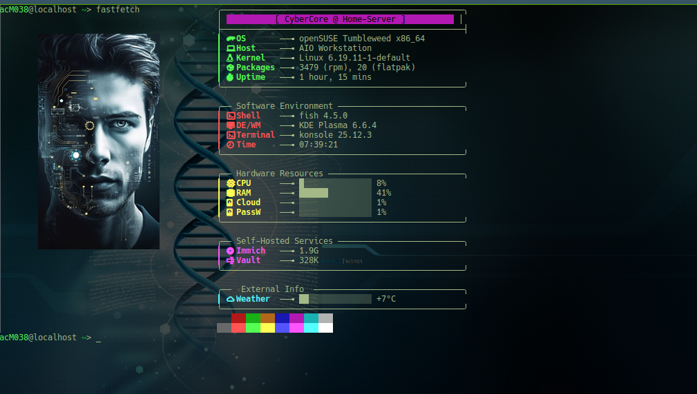

# ⚡ CyberCore Fastfetch Dashboard

Ein futuristisches, modulares Dashboard-Design für [Fastfetch](https://github.com/fastfetch-cli/fastfetch). Dieses Setup nutzt ein Card-Design mit abgerundeten Rahmen und farblichen Akzenten, um Systeminformationen stilvoll im Terminal zu präsentieren.



## ✨ Features
* **Neon-Header:** Markanter Titel-Block mit Hintergrundfarbe.
* **Modulare Sektionen:** Getrennte Boxen für System, Ressourcen, Services und Wetter.
* **Visuals:** Integration von Custom-Logos (Kitty-Protokoll).
* **Live-Stats:** Dynamische Balken für CPU- und RAM-Auslastung.

## 🛠️ Installation

1. **Voraussetzungen:**
   - Installiere eine [Nerd Font](https://www.nerdfonts.com/) (z.B. JetBrains Mono Nerd Font).
   - Ein Terminal mit Grafik-Support (empfohlen: **Kitty**).

2. **Dateien kopieren:**
   Klone dieses Repository und kopiere die Inhalte in deinen Fastfetch-Konfigurationsordner:
   
   ```bash
   mkdir -p ~/.config/fastfetch/
   cp config.jsonc ~/.config/fastfetch/
   cp Bild02.png ~/.config/fastfetch/
